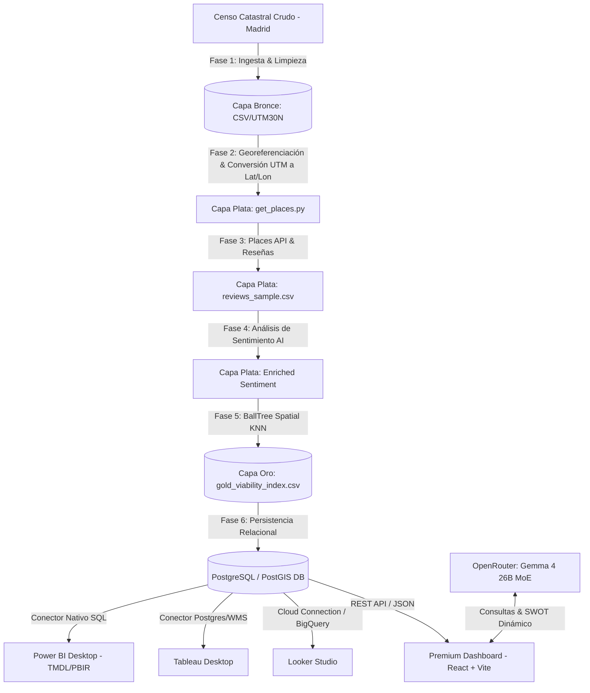
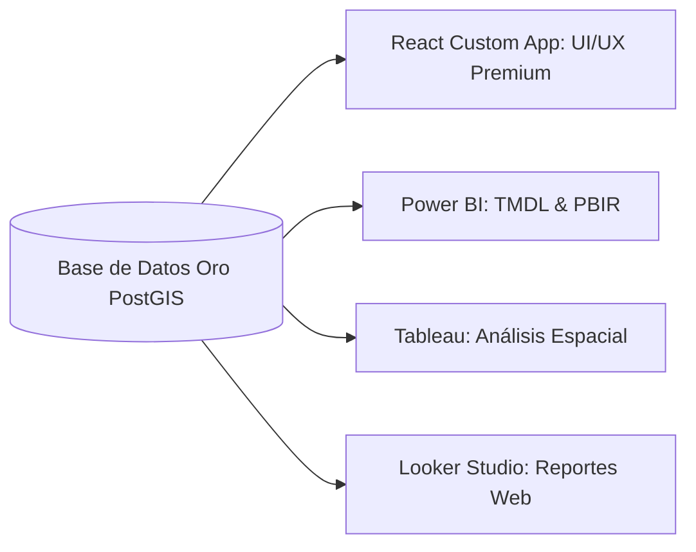

# 🌍 Geo-Predictive BI: Madrid HORECA

### *Plataforma Enterprise de Inteligencia Geovirtual, Análisis Cognitivo y Modelado Predictivo Espacial para la Optimización del Sector HORECA en Madrid.*

---

Este proyecto ha sido diseñado como una solución de **Business Intelligence (BI) Predictivo y Cognitivo** orientada a resolver un problema crítico del sector HORECA (Hoteles, Restaurantes y Cafeterías): **la alta tasa de mortalidad de nuevos establecimientos en sus primeros 24 meses**. 

El sistema combina ingesta de datos catastrales crudos, enriquecimiento cognitivo mediante Inteligencia Artificial (Procesamiento de Reseñas), un motor de similitud espacial KNN en Python, persistencia relacional en PostgreSQL/PostGIS, y una estrategia de visualización interactiva multiplataforma (**Vite/React, Power BI, Tableau y Looker Studio**).

---

## 🏗️ Arquitectura de la Plataforma (Data Pipeline & BI)



---

## 🛠️ Stack Tecnológico de Nivel Corporativo

### 1. Ingesta y ETL de Datos (Data Engineering)
*   **Python 3.11:** Core de procesamiento de datos.
*   **Pandas & NumPy:** Limpieza, normalización y alineación matricial.
*   **PyProj (EPSG:25830 a EPSG:4326):** Conversión matemática de coordenadas UTM a Latitud/Longitud para geolocalización precisa en mapas interactivos.
*   **Scikit-Learn (BallTree):** Motor de indexación espacial para realizar consultas de vecinos más cercanos (KNN) con métrica de distancia de Haversine (metros reales de la Tierra).

### 2. Capa Cognitiva e Inteligencia Artificial
*   **Google Places API (Atmosphere Data):** Extracción de reseñas crudas, rating e historial de valoraciones de locales en Madrid.
*   **Gemini API & OpenRouter SDK:** Procesamiento de lenguaje natural (NLP) estructurado para deducir el *sentiment_score*, *menu_gaps* (oportunidades en el menú) y fortalezas/debilidades de los competidores.
*   **Gemma 4 26B MoE (Mixture of Experts):** Modelo de última generación integrado vía OpenRouter para el análisis cognitivo y generación interactiva de matrices FODA (SWOT) en el frontend.

### 3. Base de Datos y Persistencia
*   **PostgreSQL 16 & PostGIS:** Motor de base de datos relacional y geoespacial que almacena la capa final optimizada (**Capa Oro**). Permite consultas SQL espaciales nativas como agrupamiento por áreas de influencia, coberturas y cálculo de distancias exactas.

---

## 📊 Estrategia Multi-Plataforma BI (Data Storytelling)

El proyecto está diseñado bajo un principio de **Independencia de Visualización**, lo que permite desplegar los insights en cuatro plataformas líderes del mercado corporativo:



### ⚛️ 1. Dashboard Custom Premium (Vite + React + Tailwind v4)
Diseñado en **HTML/React** con arquitectura táctil de alto rendimiento y estética de *Glassmorphism* (diseño translúcido y oscuro premium).
*   **Uso:** Aplicación web nativa para analistas y clientes corporativos que requieren simulación en tiempo real (SWOT/FODA dinámico mediante IA) y mapas interactivos personalizados.
*   **Ventajas:** Cero licencias por usuario, máxima flexibilidad de marca, y la capacidad de integrar el chat con el modelo de IA **Gemma 4 26B** de forma nativa en el frontend.
*   **Librerías de Mapa:** React-Leaflet integrada con capas de calor (`HeatmapLayer`) y polígonos distritales GeoJSON para la visualización de "Océanos Azules" (zonas óptimas de apertura).

### 💛 2. Power BI as Code (Moderno Formato `.pbip`)
El repositorio cuenta con una plantilla completa de **Power BI en formato moderno (.pbip)** integrada en la raíz del proyecto (`Geo_BI_Direct.pbip`).
*   **Estándares Modernos (Marzo 2026):** Utiliza **TMDL** (Tabular Model Definition Language) para la definición del modelo semántico y **PBIR** (Power BI Enhanced Reports) para los componentes visuales. Esto permite control de versiones git completo y flujos de CI/CD.
*   **Estrategia Visual:** Tarjetas de KPIs tácticos cruzados por viabilidad, visualizador de mapa nativo de Azure Maps con clústeres de calor, y segmentadores dinámicos por tipo de establecimiento y volumen de reseñas.
*   **Conexión:** Se conecta directamente a la tabla `gold.viability_index` de la base de datos relacional a través del conector nativo de PostgreSQL.

### 💙 3. Tableau Desktop (Análisis de Capacidad Territorial)
*   **Estrategia Visual:** Diseñado para la exploración profunda de datos por parte de científicos de datos y directores de expansión. Tableau utiliza su motor nativo de mapas espaciales para proyectar capas WMS del Ayuntamiento de Madrid cruzadas con los polígonos de viabilidad calculados por nuestro algoritmo.
*   **Conexión:** Acceso directo vía PostgreSQL con consultas personalizadas (*Custom SQL*) para filtrar distritos con alta concentración de locales con reseñas negativas (oportunidades de sustitución competitiva).

### 💚 4. Looker Studio (Reportes Web Livianos y Ágiles)
*   **Estrategia Visual:** Reportes ejecutivos interactivos ultra-ligeros diseñados para compartir rápidamente con inversores externos vía web. Cuenta con tablas de ranking de distritos, gráficos de dispersión de Viabilidad vs. Sentimiento de Clientes, y gráficos de barras dinámicos del mix de mercado.
*   **Conexión:** Conexión cloud nativa a PostgreSQL o BigQuery con sistema de cacheo automático diario para optimizar costos de consulta en la base de datos.

---

## 📂 Estructura de la Capa de Datos (Data Pipeline)

El ciclo de vida del dato pasa por tres niveles de refinamiento:

1.  **Capa Bronce (`data/bronze_madrid_food.csv`):** Datos catastrales limpios del Ayuntamiento de Madrid. Se estandarizan las cabeceras a snake_case y se transforman las coordenadas UTM30N a Latitud/Longitud geográficas.
2.  **Capa Plata (`data/silver_enriched_sentiment.csv`):** Enriquecimiento con la API de Google Places. Contiene las reseñas reales de los locales y el análisis de sentimiento cognitivo de 1 a 10 calculado mediante el motor de IA.
3.  **Capa Oro (`data/gold_viability_index.csv`):** Es la tabla definitiva de BI. Contiene el **Índice de Viabilidad de Apertura** (de 0 a 100) para cada local de Madrid. Este índice se calcula a través de nuestro modelo de similitud KNN (`BallTree`), el cual premia la baja densidad de competidores en el área (Océanos Azules) y penaliza la alta presencia de competidores con alta calificación de clientes (competencia feroz).

---

## 🧠 Algoritmo de Viabilidad (Capa Oro KNN)

El motor matemático implementado en `src/models/knn_similarity.py` calcula la viabilidad de la siguiente forma:

$$Viabilidad = \left( \text{Distancia Normalizada} \times W_{densidad} \right) + \left( \text{Oportunidad de Sentimiento} \times W_{sentimiento} \right)$$

*   **Distancia Normalizada:** Mide qué tan aislado está el local de sus competidores cercanos en comparación con la escala urbana dinámica de Madrid (Percentil 75). A mayor distancia, mayor el índice (Océano Azul).
*   **Oportunidad de Sentimiento:** Mide la insatisfacción de los clientes con la competencia en esa zona exacta. Si la competencia tiene malas reseñas (sentimiento bajo), el índice sube porque existe un hueco para ofrecer un servicio de mejor calidad.

---

## 🚀 Guía de Ejecución Rápida

### Requisitos Previos
*   Python 3.11+
*   Node.js 18+
*   Docker (para levantar PostgreSQL/PostGIS local)

### Paso 1: Levantar Infraestructura y Ejecutar Pipeline
```powershell
# Iniciar base de datos PostGIS
docker-compose up -d

# Ejecutar el Pipeline Maestro (Bronce -> Plata -> Oro -> Postgres)
$env:PYTHONPATH="src"
python src/pipeline_master.py
```

### Paso 2: Convertir Datos para el Dashboard Web
```powershell
python scripts/convert_data.py
python scripts/calculate_districts.py
```

### Paso 3: Iniciar el Dashboard Premium (HTML/Vite)
```powershell
cd dashboard-premium
npm install
npm run dev
```

---
**Desarrollado con estándares de ingeniería de software avanzada.**
*"De los datos a la estrategia en milisegundos."*
